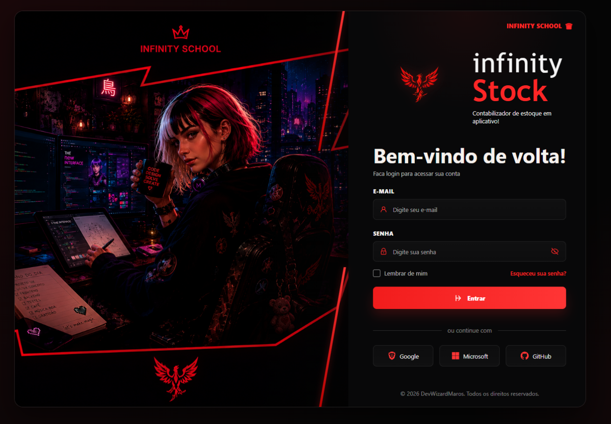

<div align="center">



# Infinity Control

### Gerenciamento remoto de computadores para escolas e laboratórios

Sistema full-stack desenvolvido para gerenciar computadores organizados por salas ou laboratórios, oferecendo suporte para ambientes Linux e Windows.

</div>

---

## 📖 Sobre o projeto

O **Infinity Control** permite administrar remotamente os computadores de uma instituição de ensino por meio de uma interface web ou pelo terminal.

A aplicação oferece recursos como:

- Visualização das salas e seus computadores;
- Wake-on-LAN;
- Teste de conectividade via SSH;
- Desligamento e reinicialização remotos;
- Atualização do sistema operacional;
- Instalação remota de pacotes;
- Execução de comandos personalizados;
- Gerenciamento e autenticação de usuários;
- Suporte para computadores Linux e Windows.

O sistema pode ser utilizado por **qualquer escola ou laboratório**. Todas as configurações específicas da instituição, como rede, salas, credenciais e sistemas operacionais, são definidas por meio de um arquivo `.env`.

---

## 🏗️ Arquitetura

O projeto está dividido em duas aplicações principais:

| Aplicação | Tecnologias | Responsabilidade |
|---|---|---|
| `backend/` | FastAPI, Python e SQLAlchemy | API, autenticação, regras de negócio e comandos remotos |
| `frontend/` | React e Vite | Interface web utilizada pelos responsáveis de TI |

O backend utiliza **arquitetura hexagonal**, separando:

- Regras de negócio;
- Casos de uso;
- Adaptadores externos;
- API e interface de terminal.

A API FastAPI é consumida pelo frontend, mas o sistema também pode ser utilizado por meio da linha de comando disponível em `entrypoints/cli.py`.

---

## 🛠️ Tecnologias utilizadas

### Backend

- Python;
- FastAPI;
- SQLAlchemy;
- Pydantic;
- SQLite;
- JWT;
- Bcrypt;
- Paramiko;
- Wake-on-LAN.

### Frontend

- React;
- JavaScript;
- Vite;
- HTML;
- CSS.

### Infraestrutura e comunicação

- API REST;
- SSH;
- Wake-on-LAN;
- Variáveis de ambiente;
- CSV para inventário de computadores.

---

## 📁 Estrutura do projeto

```text
CCI/
├── backend/
│   ├── .env                     # Configuração local (não versionada)
│   ├── .env.example             # Modelo de configuração
│   ├── config.py                # Configurações das salas e sistemas
│   ├── computadores.csv         # Inventário de computadores
│   ├── users.db                 # Banco SQLite (não versionado)
│   ├── requirements.txt
│   │
│   ├── domain/                  # Entidades, contratos e regras de domínio
│   │   ├── entities.py
│   │   ├── ports.py
│   │   └── errors.py
│   │
│   ├── application/             # Casos de uso da aplicação
│   │   ├── auth_service.py
│   │   ├── user_service.py
│   │   └── sala_service.py
│   │
│   ├── adapters/                # Implementações das portas do domínio
│   │   ├── db.py
│   │   ├── csv_repository.py
│   │   ├── ssh_executor.py
│   │   ├── wol_sender.py
│   │   └── security.py
│   │
│   ├── entrypoints/             # Entradas da aplicação
│   │   ├── api.py
│   │   ├── api_deps.py
│   │   ├── schemas.py
│   │   ├── cli.py
│   │   └── routers/
│   │       ├── auth_router.py
│   │       ├── users_router.py
│   │       └── salas_router.py
│   │
│   ├── scripts/
│   │   └── create_user.py
│   │
│   └── tools/
│       ├── teste_sistema.py
│       └── diagnostics/
│
└── frontend/
    ├── index.html
    ├── vite.config.js
    ├── package.json
    └── src/
        └── # Aplicação React: login, dashboard, componentes e estilos
```

---

## ⚙️ Configuração do ambiente

Acesse a pasta do backend e copie o arquivo de exemplo:

```bash
cd backend
cp .env.example .env
```

Depois, edite o arquivo `.env` com as informações da instituição.

### Principais variáveis

| Variável | Descrição |
|---|---|
| `SCHOOL_NAME` | Nome da instituição exibido pela API |
| `WOL_BROADCAST_IP` | Endereço de broadcast utilizado pelo Wake-on-LAN |
| `COMPUTERS_CSV_PATH` | Caminho do inventário de computadores |
| `SALAS` | Lista de salas separadas por vírgula |
| `DEFAULT_SALA_OS` | Sistema operacional padrão das salas |
| `DEFAULT_SALA_USERNAME` | Usuário SSH padrão |
| `DEFAULT_SALA_PASSWORD` | Senha SSH padrão |
| `DEFAULT_SALA_SSH_PORT` | Porta SSH padrão |
| `SECRET_KEY` | Chave utilizada para assinar tokens JWT |
| `DATABASE_URL` | Endereço do banco de dados |
| `ALLOWED_CARGO` | Cargo autorizado a acessar o sistema |
| `CORS_ORIGINS` | Origens autorizadas a consumir a API |

### Configuração específica por sala

As configurações de cada sala podem sobrescrever os valores padrões:

```env
SALA_<NOME>_OS=linux
SALA_<NOME>_USERNAME=usuario
SALA_<NOME>_PASSWORD=senha
SALA_<NOME>_SSH_PORT=22
```

Substitua espaços por `_` e utilize o nome da sala em letras maiúsculas.

Exemplo:

```env
SALA_LABORATORIO_01_OS=windows
SALA_LABORATORIO_01_USERNAME=administrador
SALA_LABORATORIO_01_PASSWORD=senha_segura
SALA_LABORATORIO_01_SSH_PORT=22
```

Os valores aceitos em `OS` são:

- `linux`;
- `windows`.

### Gerando a chave JWT

Para gerar uma chave segura para `SECRET_KEY`, execute:

```bash
python -c "import secrets; print(secrets.token_hex(32))"
```

> Nunca compartilhe ou versione a chave definida em `SECRET_KEY`.

---

## 📊 Inventário de computadores

Os computadores são cadastrados no arquivo CSV configurado em `COMPUTERS_CSV_PATH`.

### Formato esperado

```csv
MAC,IP,Sala
0A-E0-AF-AE-05-4F,35.0.0.100,Servidor
0A-E0-AF-F4-13-A1,35.0.0.101,Paris
```

Cada registro deve possuir:

| Campo | Descrição |
|---|---|
| `MAC` | Endereço MAC utilizado pelo Wake-on-LAN |
| `IP` | Endereço IP utilizado na conexão remota |
| `Sala` | Sala à qual o computador pertence |

O valor da coluna `Sala` deve corresponder a uma das salas definidas na variável `SALAS`.

---

## 🚀 Instalação

### Pré-requisitos

Antes de iniciar, instale:

- Python 3.10 ou superior;
- Node.js 18 ou superior;
- npm;
- Git.

### 1. Clone o repositório

```bash
git clone URL_DO_REPOSITORIO
cd CCI
```

### 2. Configure o backend

```bash
cd backend

python -m venv .venv
```

Ative o ambiente virtual.

#### Linux ou macOS

```bash
source .venv/bin/activate
```

#### Windows — PowerShell

```powershell
.venv\Scripts\Activate.ps1
```

#### Windows — Prompt de Comando

```cmd
.venv\Scripts\activate
```

Instale as dependências e configure o ambiente:

```bash
pip install -r requirements.txt
cp .env.example .env
```

> No Windows, você também pode copiar o arquivo manualmente ou utilizar `copy .env.example .env`.

### 3. Configure o frontend

Em outro terminal:

```bash
cd frontend
npm install
```

---

## 👤 Usuários e autenticação

Os usuários são armazenados em um banco SQLite e possuem:

- Nome;
- Login;
- Senha;
- Cargo.

As senhas são armazenadas utilizando hash seguro e não ficam salvas em texto puro.

Somente usuários cujo cargo corresponda ao valor de `ALLOWED_CARGO` podem utilizar as funcionalidades protegidas da API.

Por padrão:

```env
ALLOWED_CARGO=TI
```

Usuários com outro cargo conseguem realizar login, mas recebem uma resposta HTTP `403 Forbidden` ao tentar acessar funcionalidades restritas.

### Criando o primeiro usuário

Na pasta `backend/`, execute:

```bash
python scripts/create_user.py \
  --name "Fulano da Silva" \
  --login fulano \
  --cargo TI
```

A senha será solicitada de forma interativa.

---

## 🌐 Executando a API

Na pasta `backend/`, execute:

```bash
uvicorn entrypoints.api:app --host 0.0.0.0 --port 8000
```

A API ficará disponível em:

```text
http://localhost:8000
```

A documentação interativa do Swagger estará disponível em:

```text
http://localhost:8000/docs
```

---

## 🔐 Autenticação na API

### Realizar login

Envie uma requisição para:

```http
POST /auth/login
```

Exemplo utilizando `curl`:

```bash
curl -X POST http://localhost:8000/auth/login \
  -d "username=fulano&password=SUA_SENHA"
```

A API retornará um token JWT.

### Utilizar o token

Nas rotas protegidas, envie o token no cabeçalho:

```http
Authorization: Bearer SEU_TOKEN
```

---

## 🧭 Principais rotas

| Método | Rota | Descrição |
|---|---|---|
| `POST` | `/auth/login` | Realiza login e retorna o token JWT |
| `GET` | `/auth/me` | Retorna o usuário autenticado |
| `GET` | `/users` | Lista os usuários |
| `POST` | `/users` | Cria um usuário |
| `DELETE` | `/users/{id}` | Remove um usuário |
| `GET` | `/salas` | Lista as salas e seus computadores |
| `GET` | `/salas/{sala}` | Exibe os detalhes de uma sala |
| `POST` | `/salas/{sala}/wake` | Envia Wake-on-LAN para a sala |
| `GET` | `/salas/{sala}/connectivity` | Testa a conexão SSH |
| `GET` | `/salas/{sala}/system-info` | Consulta informações dos sistemas |
| `POST` | `/salas/{sala}/poweroff` | Desliga os computadores |
| `POST` | `/salas/{sala}/restart` | Reinicia os computadores |
| `POST` | `/salas/{sala}/update` | Atualiza os sistemas operacionais |
| `POST` | `/salas/{sala}/install` | Instala um pacote |
| `POST` | `/salas/{sala}/command` | Executa um comando personalizado |

> Com exceção de `/auth/login`, todas as rotas exigem um token válido de um usuário autorizado.

### Instalação remota de pacote

Exemplo de corpo da requisição:

```json
{
  "package": "nome-do-pacote"
}
```

---

## 🖥️ Uso pelo terminal

Além da API, o backend disponibiliza um menu interativo pelo terminal.

Na pasta `backend/`, execute:

```bash
python -m entrypoints.cli
```

A CLI utiliza os mesmos casos de uso da API, mantendo as regras de negócio centralizadas na camada `application/`.

---

## 💻 Executando o frontend

Na pasta `frontend/`, execute:

```bash
npm run dev
```

O Vite exibirá no terminal o endereço local da aplicação. Normalmente:

```text
http://localhost:5173
```

---

## 🔧 Sistemas operacionais suportados

Cada sala pode ser configurada com:

```env
OS=linux
```

ou:

```env
OS=windows
```

A aplicação seleciona automaticamente os comandos adequados para:

- Desligar;
- Reiniciar;
- Atualizar o sistema;
- Instalar pacotes;
- Consultar informações;
- Executar comandos personalizados.

Os modelos de comandos estão configurados em:

```text
backend/config.py
```

na estrutura:

```python
OS_COMMAND_TEMPLATES
```

---

## 🔒 Segurança

Para utilizar o sistema com segurança:

- Nunca versione o arquivo `.env`;
- Nunca versione arquivos `*.db`;
- Utilize uma `SECRET_KEY` forte;
- Não compartilhe credenciais SSH;
- Restrinja as origens configuradas em `CORS_ORIGINS`;
- Utilize senhas diferentes em ambientes de desenvolvimento e produção;
- Evite utilizar credenciais administrativas quando não for necessário;
- Mantenha o sistema disponível apenas em redes autorizadas.

---

## 🚨 Cuidados importantes

- Confirme operações destrutivas antes de desligar ou reiniciar computadores;
- Teste a conectividade antes de executar comandos em massa;
- Verifique se os endereços IP e MAC estão corretos;
- Valide se a sala utiliza Linux ou Windows;
- Faça testes em poucos computadores antes de utilizar ações em toda a sala;
- Não execute comandos personalizados sem verificar seu impacto.

Antes de realizar operações em massa, utilize:

```http
GET /salas/{sala}/connectivity
```

---

## 🗺️ Próximas melhorias

- [ ] Finalizar o dashboard web;
- [ ] Exibir o status individual dos computadores;
- [ ] Adicionar confirmação visual para ações críticas;
- [ ] Criar histórico de comandos executados;
- [ ] Implementar logs de auditoria;
- [ ] Adicionar filtros e pesquisa por computador;
- [ ] Melhorar o gerenciamento de usuários;
- [ ] Criar testes automatizados;
- [ ] Preparar implantação em produção.

---

## 🤝 Contribuição

Contribuições são bem-vindas.

1. Faça um fork do projeto;
2. Crie uma branch:

```bash
git switch -c feature/nome-da-funcionalidade
```

3. Faça suas alterações;
4. Crie um commit:

```bash
git commit -m "feat: adiciona nova funcionalidade"
```

5. Envie a branch:

```bash
git push origin feature/nome-da-funcionalidade
```

6. Abra um Pull Request.

---

## 👨‍💻 Autores

Projeto desenvolvido para facilitar o gerenciamento de computadores em escolas e laboratórios de informática.

---

<div align="center">

Desenvolvido com dedicação para tornar a gestão de laboratórios mais segura e eficiente.

</div>
